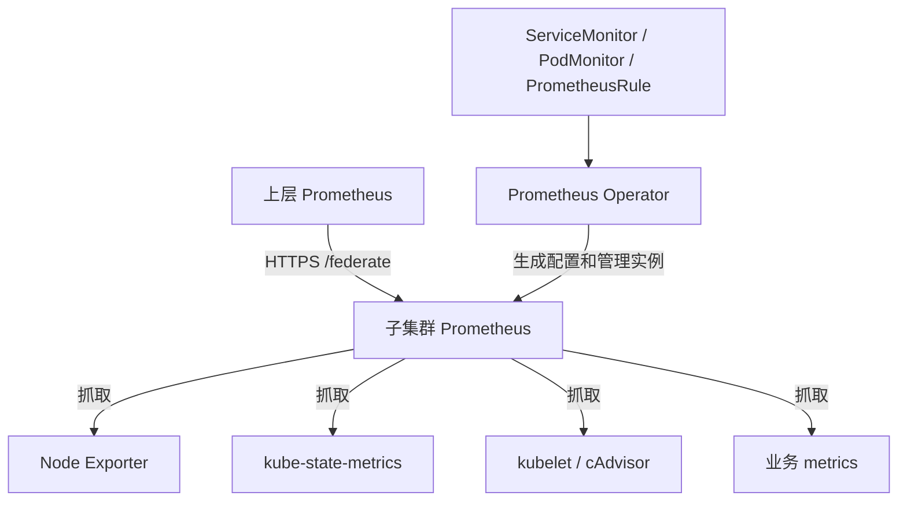

# Kubernetes 生产级部署 kube-prometheus-stack

本文整理从最初的纯 Prometheus 部署，到引入 ServiceMonitor、改用 kube-prometheus-stack 的完整过程。目标是子集群本地采集和短期存储，上层 Prometheus 通过 HTTPS Federation 汇总。

沿用 [Kubernetes 生产级部署 Node Exporter](https://www.liuchong.tech/blog/kubernetes-node-exporter-production) 的章节组织方式：先讲架构，再给部署配置，最后解释参数、验证和问题处理。

本文采用：

| 项目 | 配置 |
|---|---|
| 命名空间 | monitoring |
| Stack Release | monitoring |
| Prometheus | 单副本、Server 模式、PVC、保留 7 天 |
| Alertmanager / Grafana | 子集群关闭 |
| Node Exporter | 复用独立 Release node-exporter |
| 已知 Node Exporter Chart | prometheus-node-exporter 4.57.0 |
| 已知 Node Exporter 应用版本 | 1.12.1 |
| Stack Chart 版本 | 用户未提供；安装前选定并固定 |
| 示例环境 | cluster-a、region-a，均为替换用示例 |

> 本文是操作指南，没有连接实际集群执行部署。资源名称、StorageClass、网络模式和 Chart 兼容性需要以实际环境为准。原博客网页读取失败，排版参考此前保存的同名 Markdown 原稿。

---

## 一、整体架构



Node Exporter 负责宿主机资源，kube-state-metrics 负责 Kubernetes 对象状态，kubelet/cAdvisor 负责容器使用量。Operator 管理配置和实例；真正发送抓取请求的是 Prometheus Pod。

---

## 二、从纯 Prometheus 到 kube-prometheus-stack

| 对比 | prometheus-community/prometheus | prometheus-community/kube-prometheus-stack |
|---|---|---|
| 核心进程 | Prometheus | 同样是 Prometheus |
| 管理方式 | Helm 管理工作负载和配置 | Helm 安装 Operator，Operator 管理实例 |
| 采集配置 | scrape_configs | ServiceMonitor、PodMonitor，也可附加原生配置 |
| 规则 | 原生规则文件 | PrometheusRule |
| Kubernetes 配套 | 按需组合 | 集成监控组件、规则和可选 Grafana |
| Federation | 支持 | 支持 |
| 运维复杂度 | 配置简单，需自行维护任务 | 多一层 CRD/控制器，便于声明式接入 |

最初的纯 Prometheus 方案适合静态或原生服务发现配置；后续需要 ServiceMonitor，因此本文主线改为 kube-prometheus-stack。ServiceMonitor 不是 Prometheus 自己能识别的资源，需要 Operator 转换成抓取配置。详见 [Operator 设计](https://prometheus-operator.dev/docs/getting-started/design/)。

业务只添加 `prometheus.io/scrape` 注解，并不能保证 Stack 自动采集：还必须有相应的抓取配置。本文统一使用 ServiceMonitor/PodMonitor。

如果已经安装旧的纯 Prometheus Release，新 Stack 不会自动接管它或迁移 TSDB。先并行验证，再切换上层入口，最后处理旧 Release 和 PVC；不要直接把不同 Chart 当作原地替换升级。

---

## 三、部署前检查

```bash
kubectl config current-context
kubectl get nodes -o wide
kubectl get storageclass
helm list -A
kubectl get pods -A -o wide
kubectl get crd | grep monitoring.coreos.com
```

若已有 Operator、腾讯云监控组件或其他监控栈，先明确它们管理的 Prometheus 范围和 CRD 所有权，避免多个 Operator 重复管理同一资源。

已安装 Helm 且具备创建 CRD、ClusterRole 等权限后，添加仓库：

```bash
helm repo add prometheus-community https://prometheus-community.github.io/helm-charts
helm repo update
helm search repo prometheus-community/kube-prometheus-stack --versions | head -n 15
```

选定兼容版本后设置变量，不自动选最新版本用于生产：

```bash
STACK_CHART_VERSION='替换为选定的Chart版本'
helm show chart prometheus-community/kube-prometheus-stack --version "$STACK_CHART_VERSION"
helm show values prometheus-community/kube-prometheus-stack --version "$STACK_CHART_VERSION" > stack-default-values.yaml
kubectl create namespace monitoring --dry-run=client -o yaml | kubectl apply -f -
```

---

## 四、子集群 values.yaml

保存为 `stack-values.yaml`。其中 `your-storage-class` 必须替换。本示例假设控制面组件不开放采集，因此关闭相关目标；自建集群或已具备访问条件的集群可恢复。

```yaml
prometheusOperator:
  enabled: true
  resources:
    requests:
      cpu: 100m
      memory: 256Mi
    limits:
      cpu: 500m
      memory: 512Mi

alertmanager:
  enabled: false

grafana:
  enabled: false

# 已独立安装 node-exporter，避免重复部署。
nodeExporter:
  enabled: false

kubeStateMetrics:
  enabled: true

kube-state-metrics:
  resources:
    requests:
      cpu: 100m
      memory: 128Mi
    limits:
      cpu: 500m
      memory: 512Mi

kubeApiServer:
  enabled: true

kubelet:
  enabled: true
  serviceMonitor:
    cAdvisor: true

coreDns:
  enabled: true

kubeControllerManager:
  enabled: false
kubeScheduler:
  enabled: false
kubeEtcd:
  enabled: false
kubeProxy:
  enabled: false

defaultRules:
  create: true
  rules:
    alertmanager: false
    etcd: false
    kubeControllerManager: false
    kubeSchedulerAlerting: false
    kubeSchedulerRecording: false
    kubeProxy: false

prometheus:
  enabled: true
  service:
    type: ClusterIP
    port: 9090
  prometheusSpec:
    replicas: 1
    retention: 7d
    retentionSize: 80GB
    scrapeInterval: 15s
    scrapeTimeout: 10s
    evaluationInterval: 15s
    walCompression: true
    enableAdminAPI: false
    externalLabels:
      cluster: cluster-a
      idc: region-a
      env: production
    resources:
      requests:
        cpu: 500m
        memory: 2Gi
      limits:
        cpu: "2"
        memory: 8Gi
    storageSpec:
      volumeClaimTemplate:
        spec:
          storageClassName: your-storage-class
          accessModes:
            - ReadWriteOnce
          resources:
            requests:
              storage: 100Gi
    serviceMonitorSelectorNilUsesHelmValues: false
    serviceMonitorSelector: {}
    serviceMonitorNamespaceSelector: {}
    podMonitorSelectorNilUsesHelmValues: false
    podMonitorSelector: {}
    podMonitorNamespaceSelector: {}
    ruleSelectorNilUsesHelmValues: false
    ruleSelector: {}
    ruleNamespaceSelector: {}
    probeSelectorNilUsesHelmValues: false
    probeSelector: {}
    probeNamespaceSelector: {}
```

这些资源配额是起始示例，需要根据活跃时序、抓取周期、规则计算量调整。`retention` 和 `retentionSize` 同时设置时，先达到的限制触发清理。100Gi PVC 留出空间用于 WAL、Head 和压缩期间的额外占用，不能把保留上限当作文件系统硬配额。

默认值和字段可能随版本变化，部署时检查固定版本的 [Chart values](https://github.com/prometheus-community/helm-charts/blob/main/charts/kube-prometheus-stack/values.yaml)。

---

## 五、安装与验证

```bash
helm template monitoring prometheus-community/kube-prometheus-stack \
  --namespace monitoring \
  --version "$STACK_CHART_VERSION" \
  --values stack-values.yaml > stack-rendered.yaml

helm upgrade --install monitoring prometheus-community/kube-prometheus-stack \
  --namespace monitoring \
  --version "$STACK_CHART_VERSION" \
  --values stack-values.yaml \
  --wait --timeout 15m
```

`helm template` 验证渲染，不代表集群网络、权限、镜像拉取和存储一定正常。

```bash
kubectl get pods,svc,pvc -n monitoring
kubectl get prometheus -n monitoring
kubectl get servicemonitor,podmonitor,prometheusrule -A
kubectl get statefulset -n monitoring
```

先查看实际 Service 名，再转发：

```bash
kubectl get svc -n monitoring
kubectl port-forward -n monitoring svc/monitoring-kube-prometheus-prometheus 9090:9090
```

浏览器访问 `http://127.0.0.1:9090`，查看 Targets、Service Discovery、Configuration，并查询：

```promql
up
```

```promql
count by (job) (up)
```

`helm --wait` 返回成功后，仍需确认 Operator 创建的 Prometheus StatefulSet 就绪和实际 Target 正常。

---

## 六、ServiceMonitor 如何选择目标

有三层选择关系：

| 位置 | 选择对象 |
|---|---|
| Prometheus.spec.serviceMonitorSelector | ServiceMonitor 的 metadata.labels |
| ServiceMonitor.spec.selector | Service 的 metadata.labels |
| Service.spec.selector | Pod 的 metadata.labels |

`serviceMonitorNamespaceSelector` 控制去哪些命名空间找 ServiceMonitor；ServiceMonitor 自身的 `namespaceSelector` 控制去哪些命名空间找 Service。两个字段并不是一回事。

本例的空选择器允许选择所有命名空间的所有 ServiceMonitor，前提是 Operator 监视范围和 RBAC 也允许。需要收敛时使用明确标签，但同时要让保留的自带 ServiceMonitor 满足条件。原生 Prometheus CR 中空对象与 null 的语义有区别，应检查 Helm 最终渲染结果。参见 [Operator API](https://prometheus-operator.dev/docs/api-reference/api/)。

---

## 七、业务 ServiceMonitor 示例

假设 `demo-app` 命名空间中已有带 `app: demo-api` 标签的 Pod，容器在 8080 提供 `/metrics`：

```yaml
apiVersion: v1
kind: Service
metadata:
  name: demo-api-metrics
  namespace: demo-app
  labels:
    app: demo-api
spec:
  selector:
    app: demo-api
  ports:
    - name: metrics
      port: 8080
      targetPort: 8080
---
apiVersion: monitoring.coreos.com/v1
kind: ServiceMonitor
metadata:
  name: demo-api
  namespace: demo-app
spec:
  namespaceSelector:
    matchNames:
      - demo-app
  selector:
    matchLabels:
      app: demo-api
  endpoints:
    - port: metrics
      path: /metrics
      interval: 15s
      scrapeTimeout: 10s
```

`endpoints.port: metrics` 引用的是 Service 端口名称。Prometheus 一般会发现后端 Endpoints/EndpointSlice 并逐个抓取，不是只抓一个 ClusterIP。

```bash
kubectl apply -f demo-api-monitor.yaml
kubectl get svc demo-api-metrics -n demo-app --show-labels
kubectl get endpointslice -n demo-app -l kubernetes.io/service-name=demo-api-metrics
```

---

## 八、没有 Service 时使用 PodMonitor

容器声明命名端口 `metrics` 后：

```yaml
apiVersion: monitoring.coreos.com/v1
kind: PodMonitor
metadata:
  name: demo-api
  namespace: demo-app
spec:
  selector:
    matchLabels:
      app: demo-api
  podMetricsEndpoints:
    - port: metrics
      path: /metrics
      interval: 15s
```

容器端口片段：

```yaml
ports:
  - name: metrics
    containerPort: 8080
```

同一个容器接口不要同时被多个 ServiceMonitor、PodMonitor 和附加任务重复抓取。

---

## 九、自带 ServiceMonitor 如何精简

| 组件 | 精简原则 |
|---|---|
| API Server、kubelet/cAdvisor、DNS | 有访问条件时保留 |
| controller-manager、scheduler、etcd | 托管环境不开放时关闭 |
| kube-proxy | 根据是否存在和是否可访问决定 |
| kube-state-metrics | 保留或复用已有实例 |
| Node Exporter | 复用已有独立安装 |
| Operator、Prometheus 自监控 | 保留，便于发现监控自身故障 |

关闭组件的监控开关不等于停止 Kubernetes 控制面组件。例如 `kubeEtcd.enabled: false` 只影响这个 Chart 的 etcd 监控资源。默认规则组也需要检查，不能假设对应告警一定全部自动消失。

不要手工删除 Helm 管理的 ServiceMonitor 作为长期方案，下一次升级可能重建。修改 values 后升级，并检查实际 PrometheusRule。

---

## 十、kube-state-metrics、metrics-server 与 Node Exporter

| 组件 | 数据 |
|---|---|
| metrics-server / Metrics API 实现 | kubectl top 和 HPA 使用的 CPU、内存数据 |
| kube-state-metrics | Pod 阶段、Deployment 副本、PVC 状态、资源 requests/limits |
| Node Exporter | Linux 宿主机资源和内核统计 |
| kubelet/cAdvisor | 容器 CPU、内存等运行数据 |

`kubectl top node` 正常只能证明 Metrics API 可用，通常由 metrics-server 提供，不能证明 kube-state-metrics 已部署。现代 metrics-server 的 kubelet 数据路径也不能一概写成 Summary API，应以版本为准。

```bash
kubectl get apiservice v1beta1.metrics.k8s.io
kubectl get pods -A -o custom-columns='NAMESPACE:.metadata.namespace,NAME:.metadata.name,IMAGE:.spec.containers[*].image' | grep -i kube-state-metrics
kubectl get deploy,svc -A | grep -i state-metrics
helm list -A
```

未搜索到组件名称不是严格的不存在证明：还要考虑改名、托管方式和权限。已有实例可以复用，但要核实它是否覆盖所需命名空间、是否可抓取、生命周期是否由云厂商管理。

`kubeStateMetrics.enabled` 是父 Chart 的部署开关；`kube-state-metrics.resources` 是子 Chart 的运行参数。

---

## 十一、Deployment Ready 副本指标与告警

在下层查询：

```promql
kube_deployment_status_replicas_ready{namespace="demo-app",deployment="demo-api"}
```

值为 3 表示当前 Ready 副本为 3。其他相关指标：

```promql
kube_deployment_spec_replicas
kube_deployment_status_replicas_available
kube_deployment_status_replicas_unavailable
```

Ready 与 Available 不完全相同；Available 还受 `minReadySeconds` 等条件影响。

规则示例：

```yaml
apiVersion: monitoring.coreos.com/v1
kind: PrometheusRule
metadata:
  name: demo-deployment-rules
  namespace: monitoring
spec:
  groups:
    - name: demo-deployment
      rules:
        - alert: DeploymentReadyReplicasInsufficient
          expr: |
            kube_deployment_status_replicas_ready{namespace="demo-app"}
            < kube_deployment_spec_replicas{namespace="demo-app"}
          for: 5m
          labels:
            severity: warning
          annotations:
            summary: "Deployment Ready 副本不足"
            description: "{{ $labels.namespace }}/{{ $labels.deployment }} 持续5分钟低于期望副本数"
```

该规则适用于指标来自相同采集路径的场景。它检测副本不足，不检测指标完全消失，也可能在长时间发布时触发。子集群关闭 Alertmanager 后，规则仍能计算状态，但不会自动产生通知；需要在上层配置告警与接收链路，Federation 不会自动复制规则文件。

---

## 十二、存储、升级与高可用边界

1. 单副本重启或升级时存在采集间断，上层 Federation 无法回补这段缺失数据。
2. Operator 下配置两个 Prometheus 副本通常各自创建 PVC，并独立抓取相同目标。上层需要处理重复数据，不能当成单个共享数据库。
3. 升级前备份用户 values、确认 Chart/Operator/Prometheus/Kubernetes 兼容性并阅读该版本升级说明。
4. CRD 的升级机制取决于 Chart 版本。不要假设普通 `helm upgrade` 一定完成 CRD 更新，也不要绕过冲突盲目强制接管。
5. Helm 回滚不会自动回滚 CRD schema 或恢复 TSDB 数据。

```bash
helm get values monitoring -n monitoring -o yaml > stack-values-backup.yaml
helm history monitoring -n monitoring
```

> 完整的采集接入、HTTPS Federation 和标签修改见第二篇；网络与指标缺失排查见第三篇。
